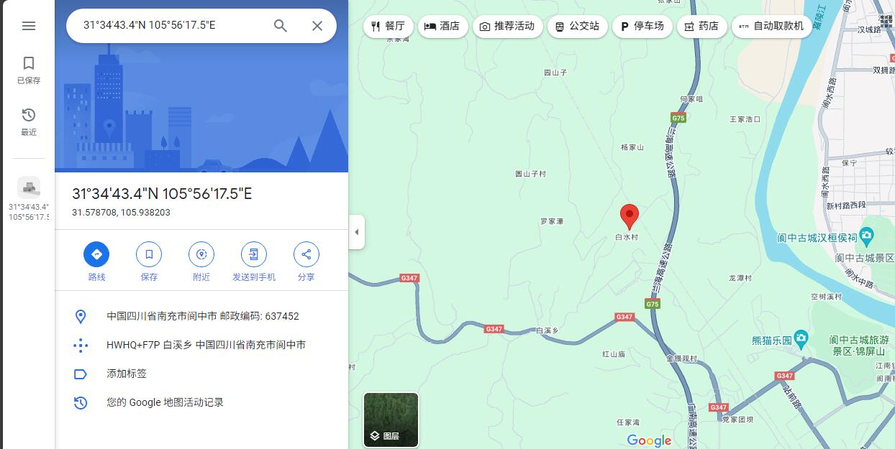
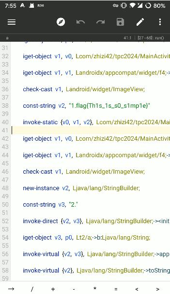
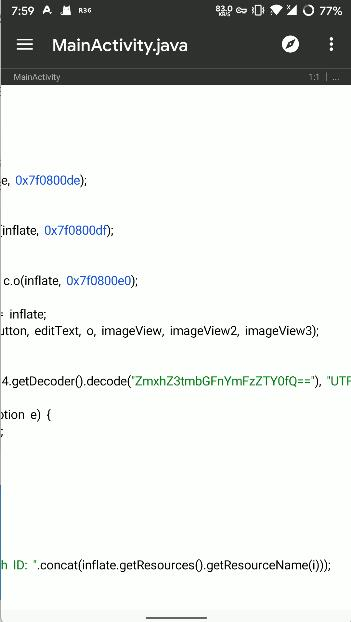

# 你说得对 这是一个wp
~~你等我先看看md怎么写~~

# Uncrackable
打开压缩包能看见里面一个anticheat.js和一个m4a 
碰巧viewsource平台的时候看见了[anticheat.js](https://www.tpcup.org/anticheat.js) 
于是想到用明文攻击 m4a就出来了 
听一下 是**果子**（？
直接记事本打开翻到最后就看见flag了
# bepbep
打开附件看见文件名是**morse** 摩斯电码 找了下工具[Morse Code Reader](https://play.google.com/store/apps/details?id=org.jfedor.morsecode&pli=1)

 解码得到
>FLAG G3T F14G FR0M MOR3ECAD3 ADD UNDERLINE BETWEEN EACH WORD GO TO [HTTPS://STORAGE.WEAROS.FANS/AMARKET/NAME.WAV](https://storage.wearos.fans/amarket/name.wav) (ALL LOWERCASE)

然后交flag怎么都交不上？
N0pe是这样说的:

看看[name.wav](https://storage.wearos.fans/amarket/name.wav) 熟悉的sstv

# 非常好忽悠混合
打开[15分钟的米家游戏音乐混剪，让你彻底爱上米哈游](https://www.bilibili.com/video/BV1hu4y1N7vg) 这边缓存名找彩蛋已经是[**数据删除**]了

来看看视频 看见flag一闪而过了 第一次截屏就截到了

~~原害了你~~

# 心中无码，自然高清
稍微改了下生成了一张a-z A-Z _ 的马赛克 
秉着尊重题目的原则 ~~直接用眼睛看看吧~~
随便找一个能显示色号的网站拿去和原片比一下就有了 ~~附件问题比了个两天没出来~~
# 我朝，大盒
你小子不会看exif是吧 ***x3***

可以看见exif里iso是138 有经纬度 定位一下 旁边是G75

知道是阆中了 那么把经过阆中站的车次都调出来 ~~一个一个试就好了~~

至于出题人和苦茶子的身份证.... ~~我不到啊~~
# 躺平问答
>上周，身为2024届英才计划培养对象的出题人ZianTT参加了一次冬令营，请问他的活动大致地点是？

去搜一下2024英才冬令营可以知道某人去哈工大了 ~~貌似搜出来一份学员名单~~
>在2023年，Cloudflare因为机房停电导致大量服务不可用，Cloudflare官方博客记载此时的英文版链接是：

关键词：cf机房停电
>QQ上线了新春活动，但糟糕的体验显然引发了一些用户的困扰，关闭该功能的链接是？

关键词：QQ关闭下拉红包
在反馈中找到收集表解密 复制链接扔进去
>HTCPCP是一种类似HTTP的协议，用于控制咖啡壶，其中，当发送了BREW请求来冲泡的时候，如果服务认为请求的添加项组合违背了饮酒者对所述种类的共识，返回的状态码是：

先去翻[HTCPCP的维基](https://zh.wikipedia.org/wiki/%E8%B6%85%E6%96%87%E6%9C%AC%E5%92%96%E5%95%A1%E5%A3%B6%E6%8E%A7%E5%88%B6%E5%8D%8F%E8%AE%AE) 里面提到出处[RFC 2324](https://www.rfc-editor.org/rfc/rfc2324) [RFC 7168](https://www.rfc-editor.org/rfc/rfc7168) 翻到其中Response Codes的部分 
>OpenAI在2024年1月发生了多少运行事件(以公示数据为准 )

见[OpenAI历史事件](https://status.openai.com/history)
>比赛平台域名tpcup.org的Registry Domain ID 是：

whois一下
>本次比赛计算服务提供商所在主体纳税人识别号是：（18位由数字和大写字母组成的字符串）

这边通过tpcup的宣传(~~开盒~~)链接 翻到最下边看见叫**晞云云科技有限公司**
去[国家企业信用信息公示系统](https://www.gsxt.gov.cn/index)查一下
# 躺平论坛
viewsource看见flag1

然后flag2呢？我不到啊

这么多random 里面啥都没有啊

看看js 啥都看不懂啊

去搜搜flarum有什么洞没 用不了啊

试试弱口令 毛都没有啊

这边万念俱灰的**加载更多**时 啥啊 [566-FLAG](https://forum.tpcup.org/d/566-FLAG) 
# 躺平聊天室
打开dex搜flag得到flag1

看看mainactivity找到一个b64 解码得到flag2{flagbase64}

flag3没看着 安装一下

啥啊 啥都没有啊

用mt管理器给他注入个log 生成 再看看

这告诉我们~~安卓逆向也需要反调试~~

# 死了

剩下的都不会了 (T_T)